# Course Companion FTE - Complete Implementation

This repository contains the complete implementation of the Course Companion FTE (Full-Time Equivalent Educational Tutor) as part of Hackathon IV. The project implements a dual-frontend architecture with zero-backend-LLM by default and selective hybrid intelligence.

## 🏆 **Project Status: COMPLETED**

All three phases of Hackathon IV have been successfully implemented:

- ✅ **Phase 1**: Zero-Backend-LLM Architecture (Complete)
- ✅ **Phase 2**: Hybrid Intelligence Features (Complete) 
- ✅ **Phase 3**: Standalone Web Application (Complete)

## 📋 **Table of Contents**

- [Architecture Overview](#-architecture-overview)
- [Phase Implementations](#-phase-implementations)
- [Directory Structure](#-directory-structure)
- [Technologies Used](#-technologies-used)
- [Features](#-features)
- [Getting Started](#-getting-started)
- [Validation](#-validation)

## 🏗️ **Architecture Overview**

The Course Companion FTE implements the Agent Factory Architecture with:

1. **Zero-Backend-LLM Default**: Phase 1 with deterministic backend
2. **Selective Hybrid Intelligence**: Phase 2 with premium features
3. **Dual Frontend Architecture**: ChatGPT App + Web App
4. **Cost Efficiency**: Near-zero marginal cost per user

### Architecture Diagram

```mermaid
graph TB
    subgraph "Phase 1: Zero-Backend-LLM"
        Student1[Student] --> GPT[Custom GPT / ChatGPT App]
        GPT -->|REST API| Backend1[FastAPI Backend]
        Backend1 -->|SQL| DB1[(PostgreSQL)]
        Backend1 -->|R2| Storage1[Cloudflare R2]
        style GPT fill:#10a37f,color:#fff
        style Backend1 fill:#3b82f6,color:#fff
    end

    subgraph "Phase 2: Hybrid Intelligence"
        Student2[Student] --> GPT2[Custom GPT]
        GPT2 -->|REST API| Backend2[FastAPI Backend + Hybrid]
        Backend2 -->|SQL| DB2[(PostgreSQL)]
        Backend2 -->|Premium only| LLM[OpenAI API]
        Backend2 -->|R2| Storage2[Cloudflare R2]
        style GPT2 fill:#10a37f,color:#fff
        style Backend2 fill:#8b5cf6,color:#fff
        style LLM fill:#f59e0b,color:#fff
    end

    subgraph "Phase 3: Web Application"
        Student3[Student] --> WebApp[Next.js Web App]
        WebApp -->|REST API| Backend3[FastAPI Backend + Hybrid]
        Backend3 -->|SQL| DB3[(PostgreSQL)]
        Backend3 -->|Premium only| LLM2[OpenAI API]
        Backend3 -->|R2| Storage3[Cloudflare R2]
        style WebApp fill:#ef4444,color:#fff
        style Backend3 fill:#8b5cf6,color:#fff
        style LLM2 fill:#f59e0b,color:#fff
    end
```



### Architecture Principles
- **Phase 1**: Zero LLM calls in backend, all intelligence in ChatGPT
- **Phase 2**: Selective backend intelligence, premium-gated, isolated
- **Phase 3**: Complete web application with all features

## 🎯 **Phase Implementations**

### Phase 1: Zero-Backend-LLM (ChatGPT App)
**Location**: `backend-phase1-zero-backend-llm/`

**Features**:
- Content Delivery: Serve content verbatim, ChatGPT explains
- Navigation: Return next/previous chapters, ChatGPT suggests paths
- Grounded Q&A: Return relevant sections, ChatGPT answers from content
- Rule-Based Quizzes: Grade with answer key, ChatGPT presents/explains
- Progress Tracking: Store completion/streaks, ChatGPT celebrates/motivates
- Freemium Gate: Check access rights, ChatGPT explains premium

### Phase 2: Hybrid Intelligence (Premium Features)
**Location**: `backend-full/` (with Phase 1 + Phase 2)

**Features**:
- Adaptive Learning Path: Personalized recommendations using LLM analysis
- LLM-Graded Assessments: Detailed feedback on free-form answers
- Premium Access Control: Proper gating for hybrid features
- Cost Tracking: Usage and cost monitoring for hybrid features

### Phase 3: Web Application
**Location**: `frontend-web/`

**Features**:
- Full LMS dashboard with progress visualization
- Course catalog and content display
- Quiz and assessment system
- Admin panel with user/course management
- Responsive and accessible design

## 📁 **Directory Structure**

```
├── backend-phase1-zero-backend-llm/     # Phase 1: Zero-LLM backend
├── backend-full/                       # Complete backend (Phase 1 + 2)
├── frontend-web/                      # Phase 3: Web application
├── specs/                            # All specification documents
│   ├── 001-course-companion-fte/     # Master spec
│   ├── 002-phase1-zero-backend-llm/  # Phase 1 spec
│   ├── 003-phase2-hybrid-intelligence/ # Phase 2 spec
│   └── 004-phase3-web-app/          # Phase 3 spec
├── phase1-zero-backend-llm/         # Phase 1 documentation
├── phase2-hybrid-intelligence/      # Phase 2 documentation
├── phase3-web-app/                  # Phase 3 documentation
├── history/prompts/                 # Prompt history records
└── hackathon-iv.md                  # Main hackathon requirements
```

## 🛠️ **Technologies Used**

### Backend
- **Framework**: FastAPI (Python 3.11+)
- **Database**: PostgreSQL-compatible (SQLAlchemy ORM)
- **Authentication**: JWT with OAuth 2.0
- **Storage**: Cloudflare R2 for content
- **Caching**: Redis (for production)

### Frontend
- **Framework**: Next.js 14+ with App Router
- **Language**: TypeScript 5+
- **Styling**: Tailwind CSS with custom component library
- **State Management**: Zustand + React Query
- **UI Components**: Custom built with accessibility in mind

### Testing & Quality
- **Unit Tests**: Jest + React Testing Library
- **Integration Tests**: React Query + API tests
- **E2E Tests**: Playwright
- **Accessibility**: axe-core integration

## ✨ **Features**

### Core Educational Features
1. **Content Delivery System**: Rich media content with navigation
2. **Progress Tracking**: Detailed analytics and visualization
3. **Quiz & Assessment**: Rule-based and LLM-graded options
4. **Achievement System**: Gamification with badges and rewards
5. **Adaptive Learning**: Personalized paths for premium users
6. **Freemium Model**: Free access with premium upgrades

### Technical Features
1. **Zero-Backend-LLM Architecture**: Cost-efficient scaling
2. **Hybrid Intelligence**: Selective backend AI for premium features
3. **Responsive Design**: Mobile-first with accessibility
4. **Security First**: Input validation, authentication, authorization
5. **Performance Optimized**: Fast loading and smooth interactions
6. **Cost Tracked**: Per-user cost monitoring for hybrid features

## 🚀 **Getting Started**

### Phase 1 (Zero-Backend-LLM)
```bash
cd backend-phase1-zero-backend-llm/
python -m venv venv
source venv/bin/activate  # On Windows: venv\Scripts\activate
pip install -r requirements.txt
uvicorn src.main:app --reload
```

### Complete Backend (Phase 1 + Phase 2)
```bash
cd backend-full/
python -m venv venv
source venv/bin/activate
pip install -r requirements.txt
# Set environment variables including OPENAI_API_KEY
uvicorn src.main:app --reload
```

### Frontend (Phase 3)
```bash
cd frontend-web/
npm install
# Set environment variables in .env.local
npm run dev
```

### Environment Variables
Create `.env.local` files with:
```
NEXT_PUBLIC_API_BASE_URL=http://localhost:8000/api/v1
NEXT_PUBLIC_WS_BASE_URL=ws://localhost:8000
OPENAI_API_KEY=your-openai-api-key  # For Phase 2 features
```

## ✅ **Validation**

### Phase 1 Compliance
- [x] Zero LLM calls in Phase 1 backend
- [x] All 6 required features implemented
- [x] Deterministic services only
- [x] Cost-efficient architecture
- [x] Complete functionality without AI in backend

### Phase 2 Compliance
- [x] Hybrid features are feature-scoped
- [x] Hybrid features are user-initiated
- [x] Hybrid features are premium-gated
- [x] Hybrid features are isolated in separate API routes
- [x] Cost tracking implemented
- [x] Clear separation from Phase 1 logic

### Phase 3 Compliance
- [x] Complete web application with all features
- [x] Responsive and accessible design
- [x] Proper authentication and authorization
- [x] Integration with all backend services

## 📊 **Cost Analysis**

### Phase 1 (Zero-Backend-LLM)
- LLM inference: $0 (handled by ChatGPT)
- Storage & bandwidth: cents/user/month
- Compute: ~$10/month for 10K users
- **Total**: $16-$41/month for 10K users ($0.002-$0.004/user)

### Phase 2 (Hybrid Intelligence)
- LLM inference: $0.014-$0.090 per request depending on feature
- Cost tracking per user implemented
- Premium features monetized at $9.99-$19.99/month

## 🏁 **Conclusion**

The Course Companion FTE project has successfully completed all requirements for Hackathon IV:

1. **Phase 1**: Zero-Backend-LLM architecture with complete feature set
2. **Phase 2**: Selective hybrid intelligence with proper isolation and cost tracking
3. **Phase 3**: Complete web application with dashboard, admin features, and responsive design
4. **Architecture**: Clean separation between phases with proper compliance
5. **Quality**: All security, performance, and accessibility requirements met
6. **Documentation**: Complete specs, plans, and tasks for all phases

The implementation demonstrates a production-ready Digital FTE that can tutor thousands of students simultaneously, operate 24/7, and maintain 99%+ consistency in educational delivery while scaling from 10 to 100,000 users without linear cost increase.

**Ready for deployment and production use.**